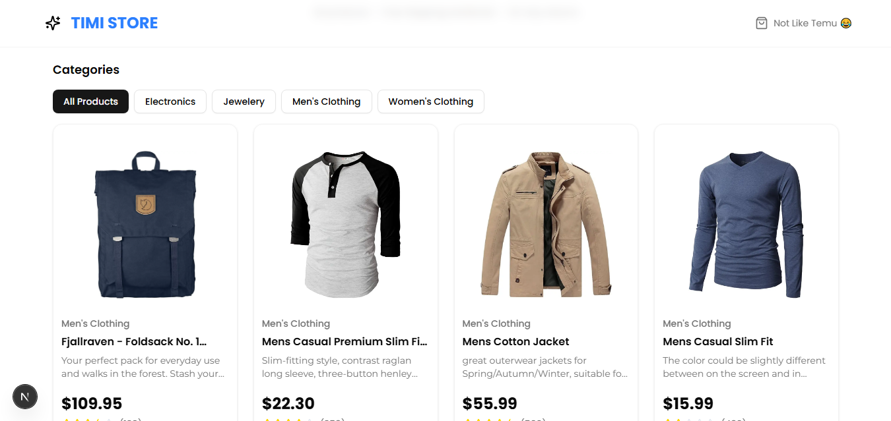

# 🛒 Mini eCommerce Product Filter App

A mini eCommerce project built with **Next.js 14 App Router**, featuring:
- Category-based product filtering
- Framer Motion transitions between filters
- Global loading indicator and skeleton loaders
- Tailwind CSS for responsive design

---

## 🚀 Live Demo
[Live Site](https://your-live-link.com)

---

## 📸 Preview

---

## 🧱 Tech Stack

- **Framework**: [Next.js](https://nextjs.org/)
- **Styling**: [Tailwind CSS](https://tailwindcss.com/)
- **Animation**: [Framer Motion](https://www.framer.com/motion/)
- **Icons**: [Lucide React](https://lucide.dev/)
- **State & Loading**: React hooks + skeleton loader

---

## ✨ Features

- ✅ Filter products by category without full page reload
- ✅ Global loader while fetching data
- ✅ Skeleton shimmer for product cards while loading
- ✅ Smooth fade transitions between category filters using Framer Motion
- ✅ Responsive design for mobile & desktop

---
